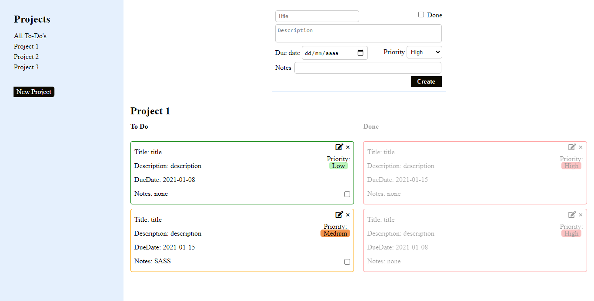

# Todo List App

This is a To Do List App using JavaScript and Webpack. With as goal learning how to apply Object Oriented Programming best practices.

## Built With

- Javascript
- Webpack
- HTML
- CSS

## Live Demo

[Live Demo Link]()

## Getting Started

To get a local copy up and running follow these simple example steps.

- Git clone https://github.com/Shaqri/todo_app.git
- Open the index.html inside the dist folder with your favorite browser
- Explore the website

### Usage

- This to-do list app allows you to create new projects on the left side pane by clicking on the 'Add new project' button, all the projects added will be shown above the add project button.

- The to-do form will be shown together with all related todos when a project is clicked, all the related added todos can be marked as 'done' by clicking on the rightmost checkbox in the todo card. All the 'done' to-dos are displayed with a lower opacity to highlight the undone to-dos.

## Author

👤 Victor Gonzalez

- Github: [@Shaqri](https://github.com/shaqri)
- Twitter: [@victorgonbu1](https://twitter.com/Victorgonbu1)
- LinkedIn: [Victor Gonzalez](https://www.linkedin.com/in/victor-manuel-gonzalez-buitrago/)

## 🤝 Contributing

Contributions, issues and feature requests are welcome!

Feel free to check the [issues page](issues/).

## Show your support

Give a ⭐️ if you like this project!